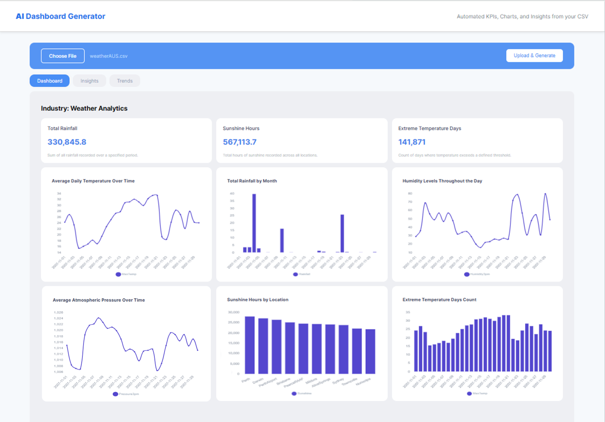

# 🌐 AI Dashboard Generator

An AI-powered system that automatically generates analytical dashboards, KPIs, and insights from CSV data using FastAPI, OpenAI, and React.
<p align="center">
  
</p>

## 🚀 Features
- Automated EDA, KPI, and chart generation
- RAG-based insight refinement
- Time-series forecasting using Prophet
- Modular FastAPI backend and React frontend

## 🧠 Tech Stack
- **Backend:** FastAPI, LangChain, OpenAI, Prophet, FAISS
- **Frontend:** React, TailwindCSS, Chart.js
- **Deployment:** Localhost / Hugging Face Spaces

## ⚙️ Setup Instructions
### Backend
```bash
cd backend
pip install -r requirements.txt
uvicorn main:app --reload

